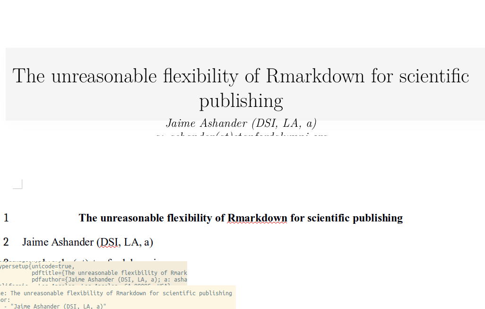

# rmarkdown-polyglot

A simple demo of rmarkdown's versatility for academic publishing. (Thanks
to [pandoc](http://pandoc.org/).)

## More Resources

* Kieran Healy's long-form exposition of the benefits of working in plain text: http://plain-text.co/record.html 
* For a growing set of templates, see the [rticles](https://github.com/rstudio/rticles) package

## Thanks

To Jon Craton for the document on which `apa_styles.docx` was based, Rintze
Zelle for `ecology.csl`, Rstudio for `rmarkdown`, and John MacFarlane for
`pandoc`!
