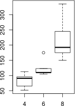

```{r fig-setup, echo=FALSE}
# Make the figs show up in "fig/" directory. Then, the first, second, etc figs
# produced are referenced with
# "fig/chunk-name-1.png", "fig/chunk-name-2.png", ..
# can use other image types. see https://yihui.name/knitr/options/
# and set other options here too, e.g., dpi=600
knitr::opts_chunk$set( fig.path="fig/", dev="png", include=FALSE)
```

# Intro


A simple demo of rmarkdown's versatility for academic publishing. (Thanks
to [pandoc](http://pandoc.org/).)

## More Resources

* Kieran Healy's long-form exposition of the benefits of working in plain text: http://plain-text.co/record.html 
* For a growing set of templates, see the [rticles](https://github.com/rstudio/rticles) package


## Thanks

To Jon Craton for the document on which `apa_styles.docx` was based, Rintze
Zelle for `ecology.csl`, Rstudio for `rmarkdown`, and John MacFarlane for
`pandoc`!

# Section

A recent study [@Ashander2012] examined how connectivity between wild and farm
louse populations could affect population dynamics, as shown in ([@eq:axiom])

$$
-1 = e ^{i\pi}
$${#eq:axiom}

# Other section

And yet, as @Rausher1992 showed, environmental effects can induce biases in the
measurement of selection. You'll notice that incomplete `.bib` files will
result in incomplete citations.

<!-- a comment to myself -->

```{r plot-one, fig.cap="", fig.width=3, include=FALSE}
boxplot(hp ~ cyl, mtcars)
```
{#fig:myfig}

By _not_ including the chunk output by default, and controlling where the figure goes (see `fig-setup`  chunk) we can then use `pandoc-crossref` to refer to the figure, like ([@fig:myfig]). 

# References
